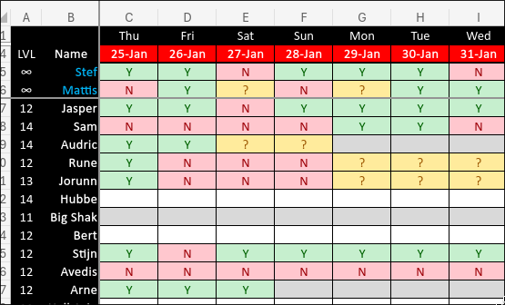
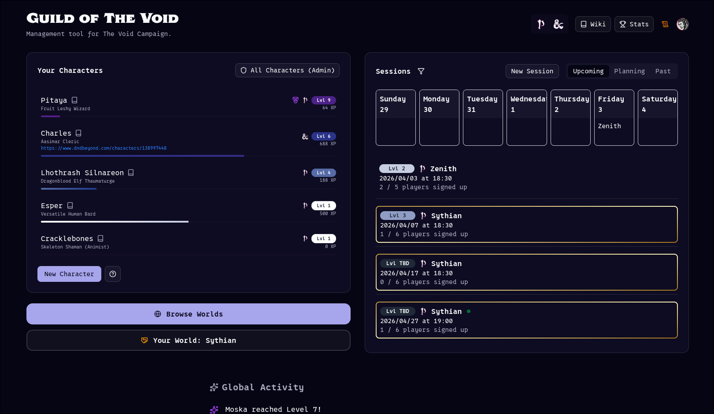
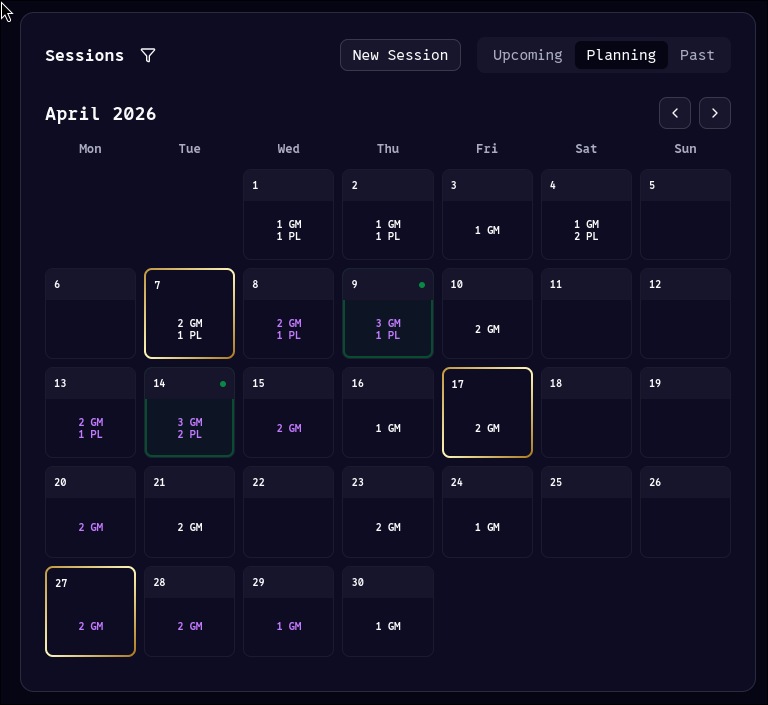
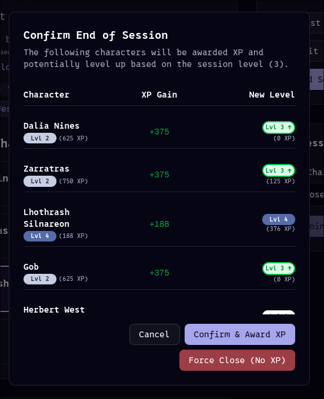

TLDR: I have been running a **lot** of westmarches, see [the endgame solution to everything](#the-endgame-solution-to-everything) on how I run it now using a custom tool dedicated for this purpose.

# Backstory
I have been running living world style campaigns[^1] (also called *west-marches*) since late 2021. It came as a necessity since I started a "little TTRPG community"[^2] in my school and quickly had much more players than I had GMs[^3].

I quickly found that the internet had a lot of advice but often communicated in *vibes*. Not a lot of practical solutions, let alone tools to manage these situations.

I will try to reference the sources going forwards but it has been quite a while and my note-taking system has evolved much since then so I'm sorry if I have forgotten some inspirations.

I was, as with many things in my TTRPG journey, first brought to the attention to these many player style campaigns through [This Video]( https://www.youtube.com/watch?v=oGAC-gBoX9k ) by the wonderful Matthew Colville. And, since he hadn't proven me wrong in the past, decided this was the solution to all of my problems. Spoiler alert: It was.

# Things I've tried
Let's take a brief summation of things I've tried and what to take away from them.

## [DnDBeyond]( https://www.dndbeyond.com/ )
I started of my GM'ing journey with D&D5e using DnDBeyond, this was a great tool to keep characters and share sources with led me to pay over € 2,000 in books alone on the site. This worked, but aside from the fact this is ridiculously expensive and riddled with bugs or missing features. They did (and currently do) not have tools to manage worlds, notes, players, sessions, times, etc. in any meaningful way.

## [WorldAnvil]( https://www.worldanvil.com/ )
I was already using WorldAnvil for regular campaigns and decided to use this when starting my first westmarches. This worked for the wiki aspect of it and even some session notes etc. But I did pay for a subscription in order to use it and use it's premium tools. This is also where I discovered I do not like leaflet.js to work with, it is very clunky and lacks needed features for fantasy maps. Although having pins on maps that link to other maps opened my eyes here.

## [Discord]( https://discord.com/ )
Discord has a large supply of bots and other features to facility TTRPGs and planning things. "Groupflows" in my experience has been the best for planning but has broken nearly weakly whilst using it. This is still the best solution for communicating with people, making a forum post for a session is the best way to give a place to plan and discuss.

## Microsoft Excel
This is the powertool, the best planning option. I'm not sure where I heard about the original option but I know *Mystic Arts* posted [a video]( https://www.youtube.com/watch?v=NHnsxEkLHFM ) about essentially the best method to plan a session.
You should use this, you should automate character Levels, etc. using scripts. But still your players/users will break the sheet, forget to fill it in and accidentally fill it in wrong.

## [Foundry VTT]( https://foundryvtt.com/ )
Starting up my second living world campaign, I decided to use foundry. Now this is a VTT and it comes with it's issues. But, it's very great to track character sheets, quests, maps, etc. I can create user accounts for people. But it's a VTT and can be a bit laggy. Plus, you need to run a server 24/7.

# The Endgame Solution to Everything
So you might feel this coming but, the solution is a custom tool. The tool I created for this is called **Guild** and I will now describe it and help you get your own tool running should you want to use something similar.

## Guild
What is guild? First off: It's not for you, it's for me. I'm not trying to sell you something. **You can't use it.**

Users go to the dedicated website on our domain and log in using their e-mail & password, google, or discord. 
They then create their character using Name, Class & Ancestry, an optional link to DnDBeyond or anything else they want.
There's a list of sessions on the right they can either put themselves as "interested" in or join right away with a character of their choosing.
There's a "Feed" at the bottom with level ups of people's characters, ranks or other cool thing to bolster some community.

In our case, we're running both DnD5.5 and PF2r. There's a filter in the top right and a light mode (for some reason, nobody uses it).

The users can navigate to the planning tab, and for each they in the future they can mark themselves as available. In much the same way as the excel does. This then gives a clean overview per day how many GMs and how many Players are available per day. With a little glowing green dot for days that have 4 availabilities of which 1 is a GM.

The design language is consistent here, with days on which you have joined a session have a purple border; And days in which you are running a session have a golden border.

The text on the days is also purple if *you* have put yourself as available.

There's also a tab for past sessions, once sessions have been "closed", a.k.a. they have ended.
Our own XP system is handled automatically by the platform. So players get a little toast notification and confetti if they have the site open or they can just consult the website to know how much xp and what level their character is.

GMs also get a neat little menu when ending a session with XP values and a little green arrow for characters that level up so they can notify those players.

Now for the, arguably, most important part. Every time a GM creates a session, it automatically creates a discord forum post in our LFG channel.

This gets updated with the amount of sign-ups and gives a place to discuss what the players want to go do, their loot, etc.

There's easy buttons for the GM to send a reminder about a session or a cancellation message.
And bonus: every time a character levels up it gets posted in the campaign's chat so we get people congratulation each other on their accomplishments.

So people go to the site to plan, to join, with their calendars or character sheets open. And they open the discord to chat.

Now you might have noticed the little book icons everywhere on the images. These link to our own wiki. Which players update and contribute to. As a player I use this during the session to take and share my notes, but that's another subject.

## How to get it running yourself
Ok, big cool and all. But how can you, dear reader, use this yourself?

Good news, I fucking hate capitalism. Meaning, it's free. You've just gotta get it set up.

The repo is [here]( https://github.com/Zorth/void-guild/ ), you can clone/fork this and set it up yourself as long as you do not use it commercially (in accordance with the PolyForm Noncommercial License 1.0.0). E-mail me if you have questions.

The site is built on Nextjs, Shadcn, Clerk (for auth), Convex (Database), Vercel (deployment)[^4]. All of these are free or the free tiers are more than you probably need. If you clone the repo you can use something like Gemini CLI to walk you through the steps if you're incompetent in programming, but the getting started steps are pretty easy:

1. Make accounts for Clerk, Convex, Vercel.
2. Setup a project in those platforms, use your git repo (pushed to your own github account) on vercel to deploy it.
3. Setup the correct environment variables on Vercel & Convex.
4. Optionally, create a discord bot, and set the discord bot environment variables as well. This is a bit more complicated then getting the site running but following the documentation shouldn't be too hard.
5. Optionally, configure your domain in vercel to get a custom domain. (Also configure this correctly with Clerk)
6. Don't forget to run `npx convex deploy`with local environment variables to update the database on convex so the database is actually setup correctly for the site to use.
7. Done.

[^1]: https://arsludi.lamemage.com/index.php/78/grand-experiments-west-marches/

[^2]: https://tarragon.be

[^3]: https://rpg.stackexchange.com/questions/112324/difference-between-a-gm-and-a-dm

[^4]: The Coding sloth has a video on this tech stack: https://www.youtube.com/watch?v=gFWZM0saGGI